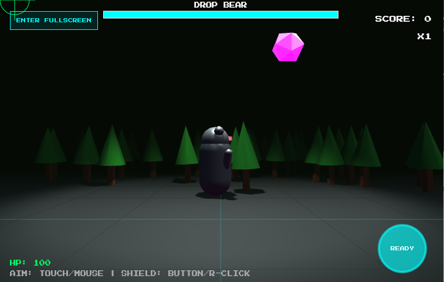

# Aussie Meme Boss Rush: 3D Story Deluxe 🇦🇺🚀

A high-octane, neon-noir 3D boss rush shooter where you face off against cybernetic versions of Australia's most infamous wildlife memes. Built with **Three.js** and designed for a seamless experience across desktop and mobile browsers.

## 🕹️ Play Now
The game is self-contained in a single HTML file.
1. Download or clone the repository.
2. Open `index.html` in any modern web browser.

## 🌟 Key Features
- **Cinematic Experience:** Star Wars-style perspective story scrollers for mission intros and outros.
- **Phase 2 Boss Transformations:** When critical health is reached, bosses enter a cinematic transformation sequence where 1/3 of their body parts turn into indestructible, glowing silver steel.
- **Dynamic 3D Bosses:** Face the "Big Five" - Drop Bear, Cyber Emu, Magpie Drone, Cyber Huntsman, and the K-9000 Roo.
- **Soft Body Physics:** Ragdoll death animations with slow-motion flailing and confetti explosions.
- **Intuitive Controls:** 
  - **Desktop:** Mouse to aim, Left-click to fire, Right-click for shield.
  - **Mobile:** Touch to aim/fire, second finger or on-screen button for shield.
- **Procedural Audio:** Real-time generated synth basslines and sound effects using the Web Audio API.
- **Responsive Design:** Supports both Landscape and Portrait orientations with dynamic UI scaling.
- **Performance:** Pure WebGL/Three.js with procedural shaders—no heavy external textures or assets.

## 🇦🇺 The Story
In the year 20XX, the Outback Protocol has been triggered. The memes of old have become sentient programs threatening to delete the human OS. As the last Cyber-Operator, you must dive into the core and delete the Big Five before they upload the 'Bogans.exe' virus to the global network.

## 🛠️ Built With
- [Three.js](https://threejs.org/) - 3D Engine
- Web Audio API - Procedural Sound
- HTML5 Canvas - 2D UI Overlay

## 📜 Development & Editing
For technical details, architectural decisions, and future roadmap, see [GEMINI.md](./GEMINI.md).

## ⚖️ License
Distributed under the MIT License. See `LICENSE` for more information.
